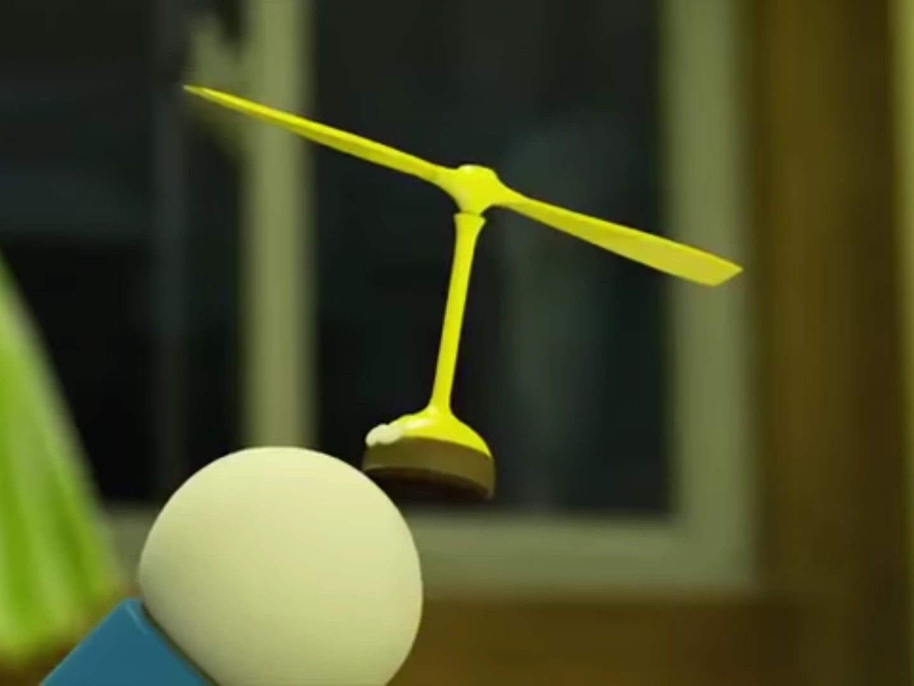
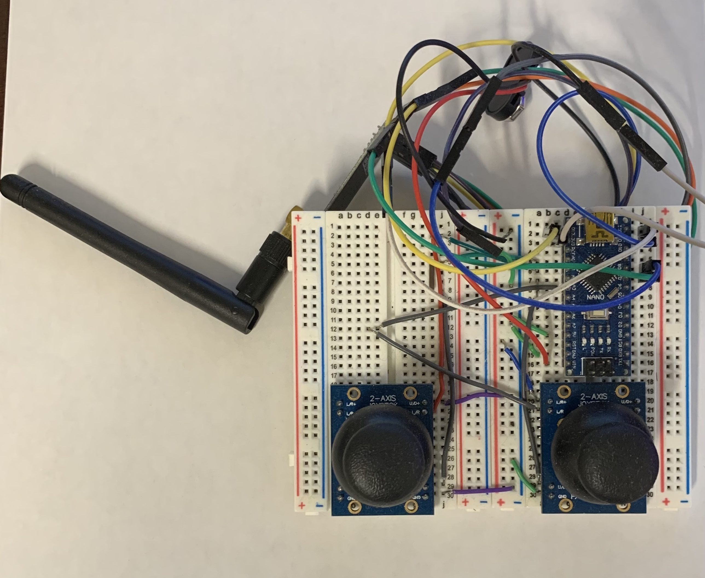

## BIM002 Helicaptor

This project was inspired by Doraemon's Bamboo-copter. 

<i>Source: Doraemon fandom wiki</i>

 
Most helicopters has a main rotor paired with a tail rotor, and most drones use 4 or more rotors. The objective of this project is to design a drone that appears to have only one rotor with a coaxial rotor design.

We tremendously underestimated the difficulty of building a drone (or anything that flies, really). The only working component is the joystick remote controller built based on [this post](https://howtomechatronics.com/projects/diy-arduino-rc-transmitter/)

<i>Our remote controller</i>

 
BIM002 is thus officially archived. 

P.S. We have a [trello board](https://trello.com/b/R4yhqvJM/helicapter) that documented the detailed project history.